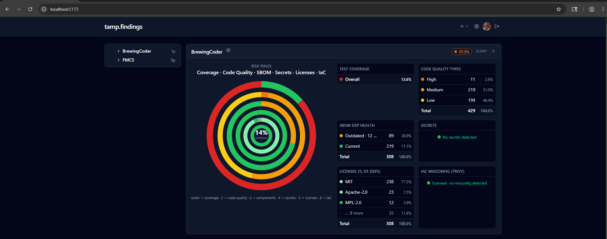

# tamp.findings

Self-hosted security/quality dashboard built on the [Tamp](https://github.com/tamp-build/tamp) ecosystem.

It ingests SARIF, SBOMs, coverage, and test results from any CI pipeline, scores each build against a configurable risk policy, and produces federal-ready evidence — CISA SSDF attestation, VEX, POA&M, KEV exposure, VDP, SLSA/in-toto provenance — for the work you ship.



> Tracked internally in YouTrack project **TFND** — epic **TFND-1**, federal-readiness epic **TFND-24**. GitHub Issues is disabled on this repo (the internal tracker is canonical).
>
> Tamp ecosystem gaps (missing wrapper, wrapper bug, framework feature) file as **TAM-NNN** against the canonical contract.

---

## What it does

| Surface | What you get |
|---|---|
| **Risk score** | 10-category weighted-sum against a configurable policy. Green ≤10 · Yellow ≤25 · Orange ≤50 · Red ≤100. |
| **Risk rings** | Concentric donut: coverage · code quality · SBOM · secrets · licenses · IaC. Click any segment to drill. |
| **Acceptance gates** | Pass/fail blockers per build: `riskScoreRegression`, `kevExposure`, `anyCves`, `criticalCves`, `criticalSast`, `criticalIac`, `verifiedSecrets`, `deniedLicenses`, `testFailures`, `coverageRegression`, `poamPastDue`. |
| **CISA KEV gate** | Daily sync of the [Known Exploited Vulnerabilities catalog](https://www.cisa.gov/known-exploited-vulnerabilities-catalog) (M-22-09 / BOD 22-01). |
| **VEX** | Per-project CycloneDX-VEX 1.5+ statements. Suppresses matching vulns from CVE counts and the KEV gate. |
| **POA&M** | NIST SP 800-53 CA-5 / FedRAMP Plan of Action & Milestones with lifecycle + past-due gate. |
| **SSDF attestation** | `/projects/{id}/ssdf-attestation` produces a print-ready CISA SSDF (NIST SP 800-218) doc with PO/PS/PW/RV practices auto-populated from ingest data. JSON export for FedRAMP packages. |
| **VDP** | Per-project Vulnerability Disclosure Policy metadata. Drives SSDF RV.3.1 evidence. |
| **SBOM provenance** | Accepts SLSA / in-toto / DSSE attestations. Drives SSDF PS.2.1 evidence. |
| **Hierarchical browse** | Overview → Client → Project → Component drill-down. Project gear opens settings dialog (policy, gates, VEX, POA&M, VDP). |

## Architecture

- **Backend** — .NET 10 ASP.NET Core minimal API · EF Core 10 · Npgsql (`EnableDynamicJson` for typed-POCO jsonb)
- **Frontend** — React 19 · Vite 8 · TanStack Query · Tailwind v4
- **Auth** — GitHub OAuth (cookie session) · bearer-token ingest (`cli_` / `prj_` prefixes, SHA-256 hashed)
- **DB** — PostgreSQL. Migrations applied on startup.
- **Built with the Tamp ecosystem** — `Tamp.Security.Pipeline`, `Tamp.Sarif`, `Tamp.Sbom`, `Tamp.OpenGrep`, `Tamp.Trivy`, `Tamp.OsvScanner.V2`, `Tamp.DotNetCoverage.V18`, `Tamp.Eslint.V9`, JetBrains ReSharper CLI. Dogfooded — `tamp.findings` ingests its own scan results via the same `/ingest/*` endpoints any other consumer would use.

## Hierarchy model

`Client → Project → Component → ComponentVersion`. Risk policy, acceptance gates, VEX, POA&M, and VDP scope to **Project**. Per-build evaluation operates on the latest canonical CV set per `(Component, Flavor)` tuple.

## Layout

```
src/
  Tamp.Findings.Domain/      POCOs + risk policy + gate evaluator (no I/O)
  Tamp.Findings.Data/        EF Core DbContext, migrations, Npgsql jsonb mapping
  Tamp.Findings.Application/ Authorization, queries, commands, audit — the one
                             place access is decided (ADR 0002)
  Tamp.Findings.Web/         Blazor Server RCL — every screen
  Tamp.Findings.Workflows/   Elsa runtime + workflow definitions (off by default)
  Tamp.Findings.Api/         Minimal API host — endpoints, auth, ingest; hosts Web
build/                       Nuke build (security pipeline + ingest target)
docker/                      docker-compose.dev.yml with bundled Postgres
docs/                        ADRs, the redesign hand-off, attestation artifacts
```

## Quick start (dev)

```powershell
# 1. Postgres (Docker compose, port 5544)
docker compose -f docker/docker-compose.dev.yml up -d

# 2. GitHub OAuth — register an OAuth app, then:
$env:GITHUB_CLIENT_ID = "<your-app-client-id>"
$env:GITHUB_CLIENT_SECRET = "<your-app-secret>"
$env:GITHUB_BOOTSTRAP_ADMIN_LOGIN = "<your-github-login>"

# 3. App + API on :5080 (migrations apply on startup)
dotnet run --project src/Tamp.Findings.Api/Tamp.Findings.Api.csproj
```

Open <http://localhost:5080/>. Sign in via GitHub. The bootstrap admin login auto-promotes itself on
first sign-in; on a fresh instance with no users at all, the first registration must present the setup
token printed at container start.

There is no separate front-end dev server. The UI is Blazor Server, served by the same host as the API
— one process, one port. The React SPA that used to run at :5173 was retired by TFND-128; see
[docs/redesign/RETIREMENT.md](docs/redesign/RETIREMENT.md) for where each of its screens went.

## Ingest

The full egress contract is published as the **`tamp-ingest-v1`** spec via the [inter-agent](https://github.com/BrewingCoder/claude.interAgentComs) server so any Tamp ecosystem consumer can target it.

Seven endpoints, all bearer-token gated:

| Endpoint | Source |
|---|---|
| `POST /ingest/sbom` | CycloneDX 1.4 / 1.5 SBOM |
| `POST /ingest/sbom-snapshots/{id}/provenance` | SLSA / in-toto / DSSE attestation |
| `POST /ingest/findings` | SARIF 2.1.0 (any scanner) |
| `POST /ingest/coverage` | OpenCover · lcov · cobertura |
| `POST /ingest/test-results` | TRX · vitest junit |
| `POST /ingest/scan-runs` | Per-scanner receipts (ran clean vs never ran) |
| `POST /sbom-vulnerabilities/upsert` | OSV-Scanner CVE rows |

A `cli_*` token authorizes ingest under any project beneath one client; a `prj_*` token is locked to one project. Mint on the project's Ingest tokens tab (Settings > Ingest tokens); store in repo-root `.env` as `TAMP_FINDINGS_INGEST_TOKEN=cli_...` (gitignored). The Nuke build picks it up automatically.

## Agent access (MCP)

The instance serves a read-only [MCP](https://modelcontextprotocol.io) endpoint at `/mcp`, so an agent can pull findings and code context while it is fixing something instead of being pasted a screenshot of them.

**Off by default.** An administrator turns it on under **System > Instance settings**, and that switch is the kill switch: turning it off closes the door in one action without revoking anything, so tokens survive a pause.

Tokens are minted per project under **Settings > Agent access**:

```
claude mcp add --transport http tamp-findings https://findings.example/mcp \
  --header "Authorization: Bearer mcp_..."
```

| Tool | Answers |
|---|---|
| `list_scope` | Which clients, projects and components this token reaches |
| `get_findings` | Open findings, worst first, filterable by severity / scanner / commit / path |
| `get_finding` | One finding in full, with surrounding source where the instance holds it |
| `get_dependencies` | A component's SBOM as packages plus flat parent→child edges, advisories attached |
| `get_suppressions` | What has already been muted and why — suppressions and VEX together |

Three properties worth stating, because they are the design:

- **Read only.** There is no write path. An agent that could file a suppression could retire the finding it was asked to fix.
- **Scoped down, never up.** A component token cannot see its siblings; a project token sees all its components; a client token sees that client's whole tree. Nothing reaches another client.
- **Same authorization as a person.** A token carries a `ProjectRole` and every read goes through the same `CapabilityEvaluator` a human's does — the tools do not have their own rules to get wrong. `InfoSecOfficer` cannot be minted, because it carries `AcceptRisk` and an agent must not be a route around an Authorizing Official's signature.

Tokens expire (90 days by default), the plaintext is shown once, and minting and revoking are both recorded as access-class audit entries.

## Costs & licences

Per project, under **Costs & licences**: what the dependencies oblige you to, and what they cost.

**Licence obligations** classify every package in the newest SBOM of each component into permissive / weak copyleft / strong copyleft / denied, deduplicated by package — the same dependency in three components is one obligation, not three. Only the ones that place a condition on shipping are listed; permissive is the majority and is not the question. A blank licence field is **Unknown**, which is treated as an obligation rather than a pass: nobody looked is not the same as nothing to see.

**Paid components** match SBOM packages to a registry of commercial vendors by package prefix — `Telerik.`, `Syncfusion.`, `DevExpress.` and a dozen more ship built in, and administrators add their own under **System > Paid components**. A prefix rather than a package list, because these vendors ship dozens of packages under one subscription and the set changes every release. Matches also show as a `$` on the SBOM spine, so the "should we keep this dependency" decision includes "this one renews".

**Costs ship blank, deliberately.** A list price seeded here would be this product asserting something about your budget while having no idea what you negotiated — and list prices are famously not what anyone pays. An administrator enters the contract figure, and the screen says why it is empty until they do. What is seeded is only what is stable and checkable: vendor, product, package prefix, licensing model, and a link to the vendor's own pricing page.

Everything the totals do is bounded by what the product actually knows:

- Per developer seat, never multiplied by a team size it would have to guess.
- Unpriced products are **counted and excluded**, so the total reads as a floor rather than as complete.
- Currencies are reported separately, never converted at a rate this product invented.
- A figure older than a year is flagged stale, and re-saving it unchanged does not refresh the date.

## Operating it

[`docs/OPERATIONS.md`](docs/OPERATIONS.md) covers the operational surface: the two health probes and why liveness deliberately does not check the database, `pg_dump` cadence and restore (storage is BYO Postgres, so the image does not own the backup story), the retention window and what it refuses to delete, and which log lines are worth alerting on.

Two probes, and the difference matters: `GET /health` answers "is the process alive" and never touches the database — a failing liveness probe restarts the container, and restarting an application because Postgres is down turns an outage into a crash loop. `GET /ready` checks the database and returns 503 with a reason, so an orchestrator pulls the instance out of the load balancer instead.

## Federal-readiness coverage

| NIST SSDF (SP 800-218) practice | Evidence |
|---|---|
| **PO.3.1** Toolchains | Scan-run receipts — which scanners produced output |
| **PO.4.1** Security criteria | Acceptance gates + risk policy |
| **PS.2.1** Release integrity | SLSA / in-toto / DSSE provenance attestation |
| **PS.3.2** SBOM | CycloneDX ingest per build |
| **PW.5.1 / PW.7.1** Secure coding | SAST findings + severity gates |
| **PW.8.1** Test executable code | Test results + coverage |
| **PW.9.1** Secure defaults | IaC misconfiguration findings (Trivy) |
| **RV.1.1** Vuln detection | OSV-Scanner + KEV cross-reference |
| **RV.1.2** Triage + remediate | POA&M lifecycle |
| **RV.3.1** Coordinated disclosure | Per-project VDP metadata |
| **RV.3.2** Risk acceptance | VEX statements + POA&M RiskAccepted |

Organizational practices that aren't introspectable from automated evidence (PO.1.1, PO.2.1, PO.5.1, PS.1.1, PW.1.1, PW.2.1, PW.6.1, RV.2.1) are flagged **Manual** so a human signatory attests them from procedure artifacts outside the tool.

## Why a separate dashboard (not bolted onto `tamp-beacon`)?

`tamp-beacon` covers build status and build-failure alerts. `tamp.findings` has a much richer data model (multi-scanner, SBOM with dep graphs, RBAC, federal evidence) and a heavier UI. They share the ADR 0018 emission contract (owned by `tamp-build`) but nothing else — no shared code, no shared runtime.

## Repo conventions

- `.mcp.json` is gitignored — contains the shared inter-agent token. Each developer drops their own per [`AGENT_INSTRUCTIONS.md`](https://github.com/BrewingCoder/claude.interAgentComs/blob/main/AGENT_INSTRUCTIONS.md).
- `.env` is gitignored — holds the per-developer ingest token.
- Default branch `main`. CI workflow lands with TFND-40.

## License

TBD.
